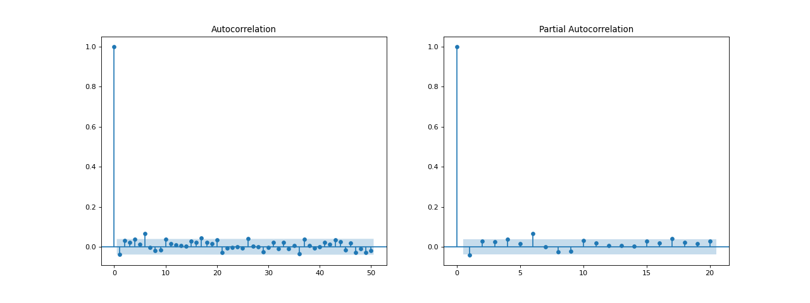
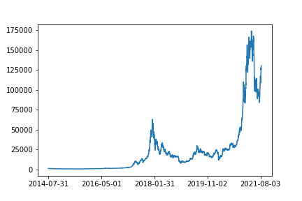

[](http://quantlet.de/)

## [](http://quantlet.de/) **CRIX_stacking** [](http://quantlet.de/)

```yaml

Name of Quantlet: CRIX_stacking

Published in: ''

Description: 'Time series data preparation for simulation and analysis with GAN. Visualisation with stacking image of the CRIX time series
              both for the original series and its log returns.'

Keywords: 'GAN, CRIX, time series, non stationarity, simulation'

Author: 'Ramona Merkl'

```







### [IPYNB Code: CRIX_stacking.ipynb](CRIX_stacking.ipynb)


automatically created on 2021-09-29