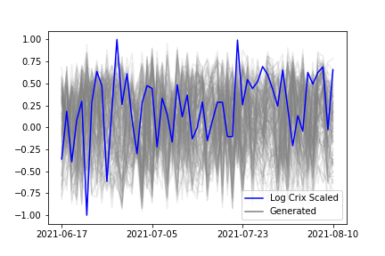

[](http://quantlet.de/)

## [](http://quantlet.de/) **CRIX_stacking** [](http://quantlet.de/)

```yaml

Name of Quantlet: CRIX_stacking

Published in: ''

Description: 'Appliaction of a simple GAN framework with Wasserstein loss on CRIX stacking images'

Keywords: 'WGAN, GAN, CRIX, time series, non stationarity, simulation, Wasserstein loss'

Author: 'Ramona Merkl'

```





